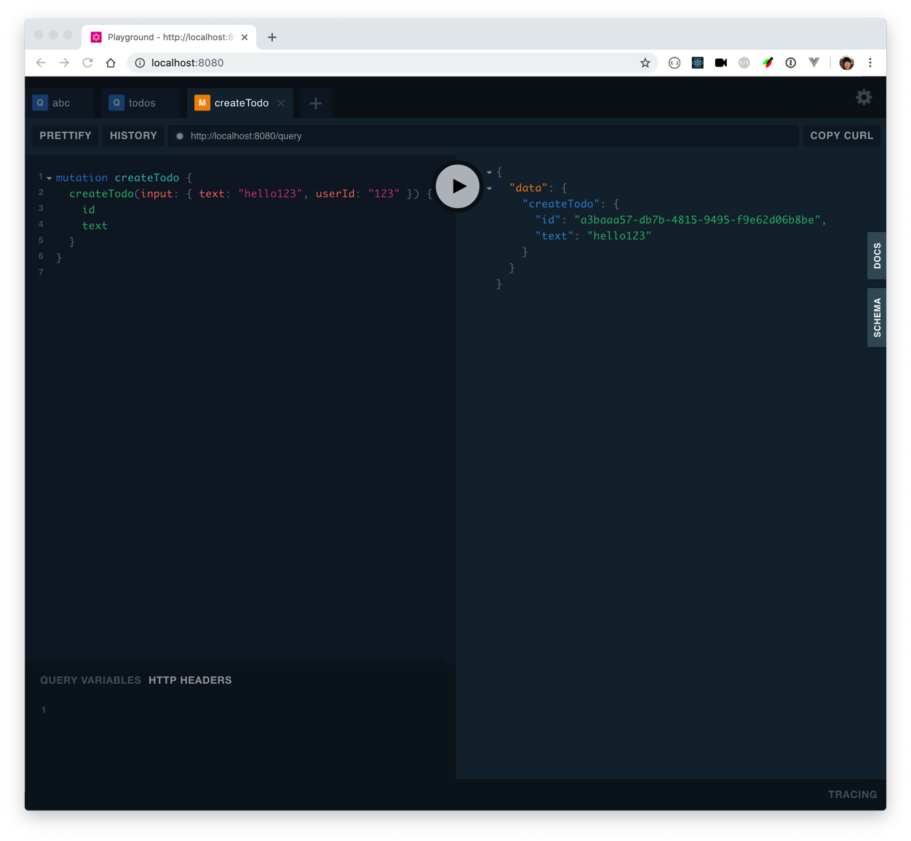
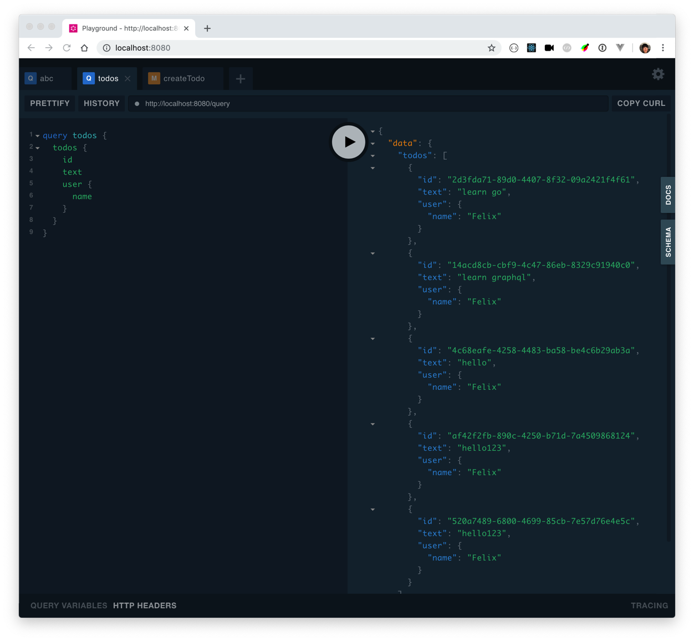

# Perfect Go graphql server side library

https://github.com/99designs/gqlgen

This is just I imagined how we should do graphql in Go. last time we checked graphql (https://github.com/theplant/graphql), There is no such good library in Go.

Just a quick show for this library:

## 1, Define schema in Standard GraphQL Type System

https://graphql.github.io/graphql-spec/draft/#sec-Type-System

```graphql
type Todo {
  id: ID!
  text: String!
  done: Boolean!
  user: User!
}

type User {
  id: ID!
  name: String!
}

type Query {
  todos: [Todo!]!
}

input NewTodo {
  text: String!
  userId: String!
}

type Mutation {
  createTodo(input: NewTodo!): Todo!
}

```

## 2, Generate implementation and stub with the tool

```
$ go run github.com/99designs/gqlgen
```

## 3, Config gqlgen.yml to decide what field use resolver

Write your own model struct to remove fields that you want to use resolver

api/models.go
```go
type Todo struct {
	ID   string `json:"id"`
	Text string `json:"text"`
	Done bool   `json:"done"`
}
```

gqlgen.yml
```yaml
...
models:
  Todo:
    model: github.com/sunfmin/go-gqlgen-graphql-demo/api.Todo
```

Note that I removed `user: User!` field compare to `schema.graphql` definition. specify the model in `gqlgen.yml` file, Then gqlgen will generate the User field as an resolver. means left you to implement this func in a different Todo resolver, Not in queryResolver anymore:

```go
func (r *todoResolver) User(ctx context.Context, obj *api.Todo) (*api.User, error) {
	fmt.Println("Calling User resolver", obj)
	return &api.User{
		ID:   "123",
		Name: "Felix",
	}, nil
}
```


## 4. Implement the resolvers stub

```go
func (r *queryResolver) Todos(ctx context.Context) ([]*api.Todo, error) {
	fmt.Println("Calling Todos resolver")
	return storeTodos, nil
}
```

## How to run this example

```
$ brew install modd
$ go get -v ./...
$ modd
```

Then access http://localhost:8080/

Create Todo Mutation


Query Todos

